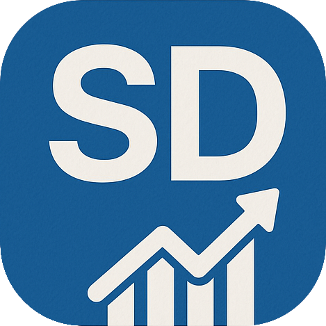

# SalesDrive

<div align="center">
  
</div>

<p align="center">
  A mobile app for managing product inventory and sales tracking on the go
</p>

## 📱 About

SalesDrive is a React Native mobile application built with Expo Router that helps small business owners manage their product inventory and track sales effortlessly. The application provides an intuitive interface for viewing products, editing product details, managing categories, and tracking sales data.

## ✨ Features

### Product Management
- View all products organized by categories
- Detailed product information with images and descriptions
- Edit product details (name, price, description, category)
- Add new product categories on the fly
- Delete products when needed

### Sales Tracking
- Track sales data for all products
- View sales history and performance metrics

### Cart Functionality
- Add products to shopping cart
- Complete sales transactions

## 🚀 Tech Stack

- **React Native** - Mobile app framework
- **Expo** - Development platform
- **Expo Router** - Navigation & routing
- **NativeWind** - Tailwind CSS for React Native
- **TypeScript** - Type-safe code

## 🛠️ Installation

Clone the repository:

```bash
git clone https://github.com/ecfesa/sales-drive.git
cd sales-drive
```

Install dependencies:

```bash
bun install
```

Start the development server:

```bash
bun start
```

## 📸 Screenshots

*Coming soon*

## 📝 Development Status

This project is currently in active development. Here's what's implemented so far:

- ✅ Product listing with category sections
- ✅ Product detail view
- ✅ Product editing functionality
- ✅ Category management
- ⏳ Sales data tracking (in progress)
- ⏳ Shopping cart functionality (in progress)

## 👥 Contributors

- Lucas Santos (@zerowhybr) 
- Rhian Barbosa (@Arguableplains)